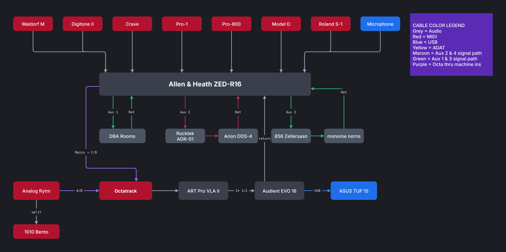

# Patchbay

A Whimsical-style diagram editor for mapping hardware studio rigs: synths, mixers, aux sends and returns, samplers, interfaces, and every cable in between.

**Open it:** https://kenneth-rakentine.github.io/Patchbay/
**Windows app:** [latest release](https://github.com/Kenneth-Rakentine/Patchbay/releases/latest)



## What it does

- **Blocks** for each piece of gear: box, rounded, pill, ellipse or plain text, with any fill, outline, text colour, S/M/L text, bold, and left or centred alignment.
- **Cables** that attach to blocks and follow them when you move things. Drag one of the dots on a block's edge to start a cable and drop it on another block.
- **Exact connections.** A normal drop snaps to the middle of the nearest side. Hold **Ctrl** while dropping to attach at the exact spot on the edge.
- **Bends you control.** Select a cable and drag a **＋** handle to add a bend, drag a bend to move it, double-click a bend to remove it. Lines can be straight, elbow (right angles) or curved.
- **Named, colour-coded cables.** Give any cable a name (ch.15/16, Aux 2, thru…) in S/M/L, plus colour, thickness, dashes and arrowheads.
- **Your own cable legend.** Name each cable colour by signal type (Audio, MIDI, USB, ADAT, aux paths…) and drop a legend block onto the board with one click.
- **Boards you can iterate on.** Duplicate a board to start a new version of your setup. Dates in the name (like `Current Setup 10/05/26`) roll forward to today automatically.
- **Export** a board as PNG or SVG, and back up or restore every board as one JSON file.

## Controls

| Action | How |
| --- | --- |
| Draw a cable | Drag a dot on a block's edge, or use the Wire tool (L) |
| Place or connect exactly | Hold Ctrl while dragging (skips the grid, attaches at the exact edge point) |
| Add / move / remove a bend | Drag ＋ on a selected cable / drag the bend / double-click it |
| Duplicate while dragging | Alt + drag |
| Edit text | Double-click a block (Ctrl+Enter or Esc to finish) |
| New block | Double-click empty space, or the Block tool (R) |
| Name a cable | Double-click the cable |
| Pan / zoom | Space + drag or middle mouse / Ctrl + scroll wheel |
| Copy, paste, duplicate | Ctrl+C, Ctrl+V, Ctrl+D |
| Undo / redo | Ctrl+Z / Ctrl+Shift+Z |
| Fit the board on screen | Shift+1 |
| Tools | V select, H pan, R block, O ellipse, T text, L wire |

## Where your boards are saved

Boards save automatically in the browser or app you're using. The website, the Windows app, and each browser keep **separate** copies. To move boards between them, open **Backup & import**, download the backup, and import it on the other side. Download a backup now and then so you always have one.

## Install it

- **As a desktop app from the website:** open the site in Chrome or Edge and click the install icon at the right end of the address bar. It gets its own window and works offline after the first visit.
- **As a Windows program:** download `Patchbay-Setup-x.y.z.exe` (installer) or `Patchbay-Portable-x.y.z.exe` (runs without installing) from [Releases](https://github.com/Kenneth-Rakentine/Patchbay/releases). Windows SmartScreen may warn about an unrecognised app because it isn't code-signed; choose **More info → Run anyway**.

## Project layout

```
index.html              the whole app (HTML, CSS and JS in one file)
manifest.webmanifest    install info for browsers
sw.js                   offline cache
icons/                  app icons
desktop/                Electron wrapper for the Windows build
.github/workflows/      builds the Windows app when a version tag is pushed
```

## Making changes

Edit `index.html` and push to `main`. GitHub Pages republishes the site within a minute or two. When you change `index.html`, also bump `VERSION` in `sw.js` so installed copies pick up the update.

To publish a new Windows build:

```bash
# bump "version" in desktop/package.json first, then:
git tag v1.0.1
git push origin v1.0.1
```

The **Build desktop app** workflow builds the installer and attaches it to a new release.

To run the desktop app locally (needs Node.js 20+):

```bash
cd desktop
npm install
npm start
```

## License

MIT
